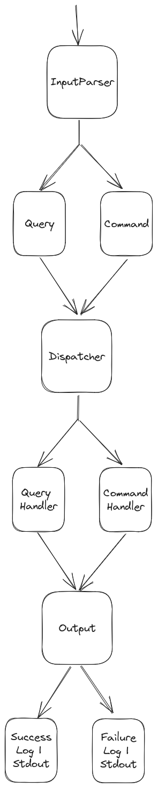

# Task Manager - Clean Architecture

*<u>Auteurs</u>: Paul Barrié - Luigi Carole - Thomas Lemaire - Si-Mohammed Sonia-taous*

## Description des cas d'usage métiers

## Utilisations

Pour lancer les tests, vous pouvez utiliser le script `./test.sh` qui va lancer les tests unitaires.

Pour utiliser l'application vous pouvez appeler le script `./agenda.sh` avec les arguments suivants :

* `./agenda.sh add -c "hello world"`
* `./agenda.sh add -pid:hczhczj -c "hello world"` (pour ajouter une sous-tache à a tâche parente avec l'id hczhczj)
* `./agenda.sh add -d:2022-03-01 -c "finalize the agenda exercise"`
* `./agenda.sh list`
* `./agenda.sh update 123 -d:2022-04-01`
* `./agenda.sh remove 123`
* `./agenda.sh update 123 -s:done`

## Description de l'Architecture retenue

Les cas d'usage métiers demandés sont globalement assez pauvre en complexité. Il s'agit peu ou proux
d'un CRUD. Le problème à traiter est au final assez simple et se découpe systématiquement en trois
phases :
* Traiter l'input fourni par l'utilisateur (via la ligne de commande)
* Opérer un traitement qui est en gros une requête à la base de données JSON
* Renvoyer des informations à l'utilisateur (par la sortie standard)

Nous avons donc simplement découpé notre solution pour traiter ces trois grands blocs : interface utilisateur,
domaine des tâches et retour utilisateur.
Nous avons pris soin de diviser les actions liées aux tâches en commande (ajout, suppression, mise à jour) 
et requêtes (get, list).

Voici un schéma avec les composants principaux de notre solution :

## Axes d'amélioration

Afin de traiter le cas des sous-taches, nous avons ajouté de la logique au sein du domaine. Nous
n'avons pas trouver d'autre méthode que  d'utiliser des méthodes récursives au sein de la classe
afin d'ajouter en cascade des sous-taches. Cela nous a semblé être une solution acceptable, mais
nous sommes conscients que cela n'est pas très propre. Une solution pourrait être de créer une
classe encapsulant la logique de gestion des sous-taches.